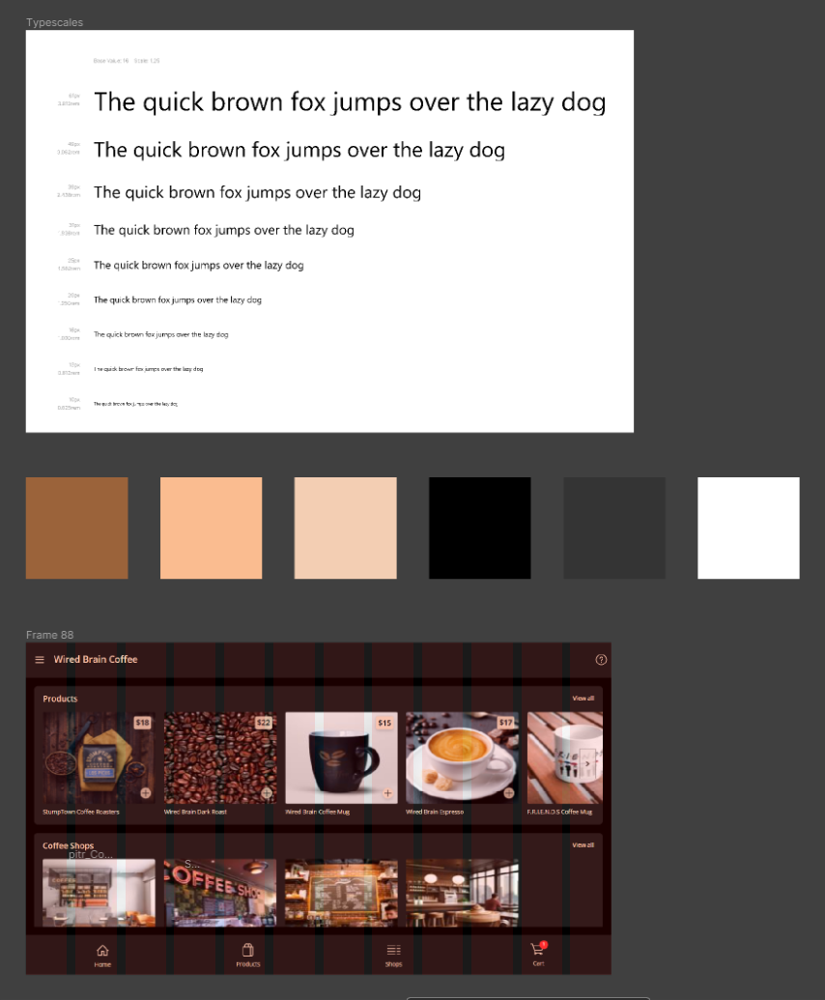
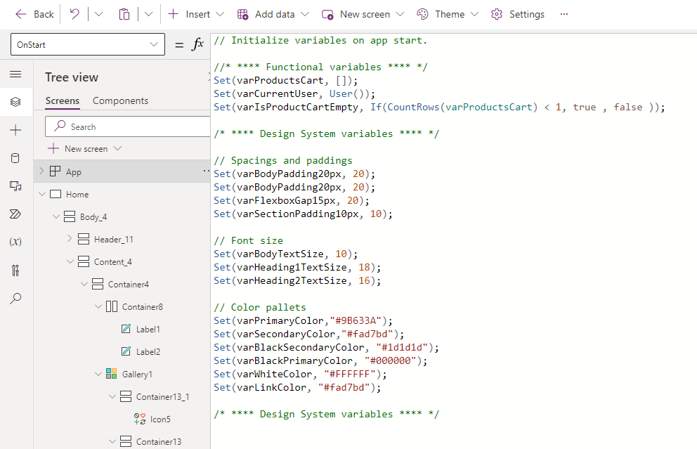
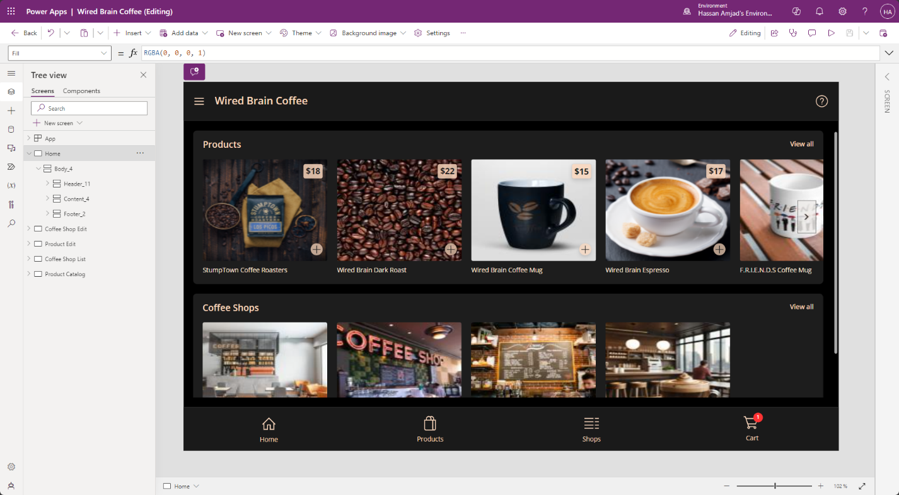
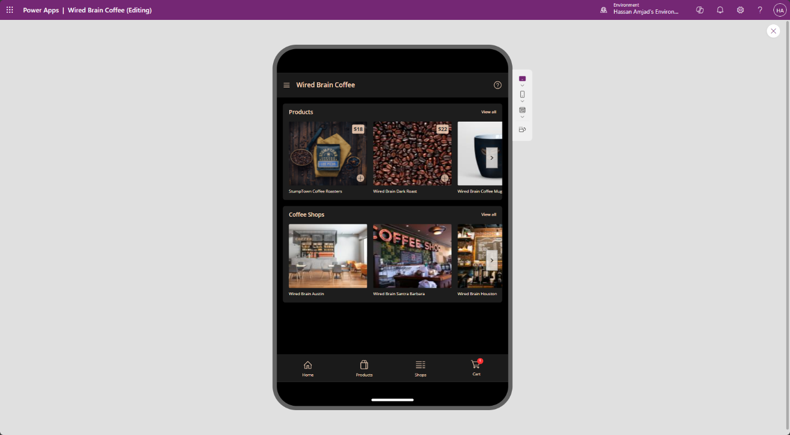
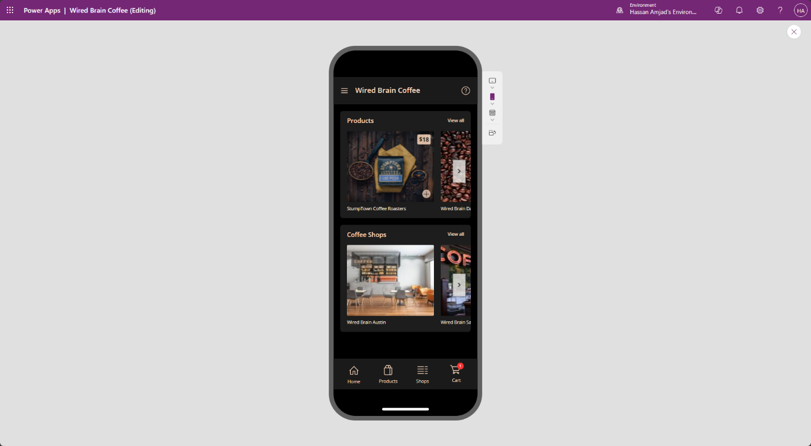

# Power Apps Showcase Project

The following showcases one of my recent projects that I implemented on the Power Platform using Canvas app model. The application was made for a coffee shop company where users can come in and buy products being sold on the shop and find info related to all the branches of the coffee shop spread across multiple states and cities.

## My Development Approach

When it comes to developing enterprise apps for SharePoint, Power Platform or D365 CE my approach is allot more robust and modern then conventional developers. Since I have expertise in UI / UX Design, I use Figma to first build the app’s design system which includes layouts, paddings, margins, typography, buttons, responsive layouts, color palettes etc. Using the design system I then start building high fidelity prototypes for the app. After this I add interactions between the prototypes to design UX Flows which I then demo to the clients.

## Design Translated to Canvas App

### Using variables to store Design System parameters

### Responsive design using flex containers

-   Desktop

-   Tablet

-   Mobile

